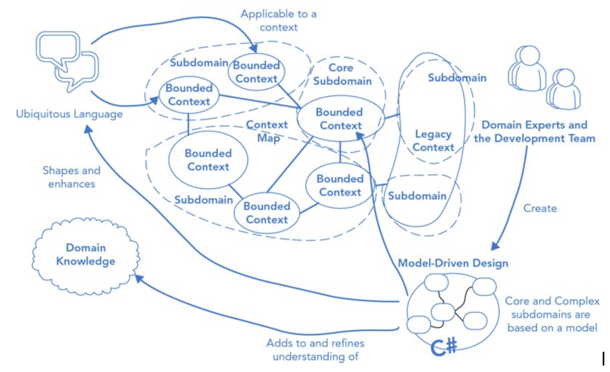

# Domain-Driven Design Definitions

## Table of Contents

1. [Domain-Driven Design (DDD)](#1-domain-driven-design-ddd)
2. [Domain](#2-domain)
3. [Model](#3-model)
4. [Ubiquitous Language](#4-ubiquitous-language)
5. [Entity](#5-entity)
6. [Value Objects](#6-value-objects)
7. [Service](#7-service)
8. [Service vs Entity](#8-service-vs-entity)
9. [Aggregate](#9-aggregate)
10. [Factory](#10-factory)
11. [Repository](#11-repository)
12. [Context](#12-context)
13. [Bounded Context](#13-bounded-context)
14. [Context Map](#14-context-map)
15. [Integration Patterns Between Contexts](#15-integration-patterns-between-contexts)
16. [Distillation Process](#16-distillation-process)
17. [Types of Domains](#17-types-of-domains)

## 1. Domain-Driven Design (DDD)

Domain-Driven Design is a software development approach that focuses on creating software deeply rooted in the business domain it serves. It emphasizes creating a model that accurately captures the core concepts and elements of the domain, then implementing that model directly in code. DDD combines design and development practices to ensure software fits harmoniously with the domain, making the code a reflection of the domain itself.



## 2. Domain

A domain is the sphere of knowledge and activity around which business processes operate - essentially the real-world problem space that software is meant to address. It's the business processes being automated or the real business problems that the software aims to solve.

**Example:** In a banking application, the domain includes concepts like accounts, transactions, customers, and financial rules.

## 3. Model

A model is a rigorously organized and selective abstraction of domain knowledge - it's the internal representation of the target domain. According to Eric Evans, "a domain model is not a particular diagram; it is the idea that the diagram is intended to convey." It's a way of structuring knowledge about the domain, synthesizing thinking about core concepts, relationships, and behaviors into a form that can be expressed in software.

## 4. Ubiquitous Language

The Ubiquitous Language is a common language shared by the entire team (developers, domain experts, stakeholders) that is based on the domain model. It's used consistently in all communications - speech, writing, diagrams, and code.

**Why We Need It:**
- Overcomes communication barriers between technical teams and domain experts
- Eliminates the need for translation between different dialects
- Ensures everyone shares the same understanding of domain concepts
- Connects the model directly to the code

## 5. Entity

An Entity is an object that has a distinct identity that remains constant throughout its lifecycle, regardless of changes to its attributes. It's distinguished by its identity rather than its attributes.

**Characteristics:**
- Has a unique, persistent identity
- Identity remains unchanged throughout the object's life
- Can be tracked across different states and representations
- Identity distinguishes it from other objects even with identical attributes
- Maintains continuity across the system's lifetime

**Examples:**

1. **Bank Account:** A bank account is an Entity identified by its account number. The balance, transactions, and even the account holder might change, but the account number remains constant and uniquely identifies that specific account throughout its existence.

2. **Person/Customer:** A person in a system has identity (perhaps Social Security number or a combination of name, birth date, and birthplace). Two people might have the same name, but they're still distinct individuals with separate identities.

## 6. Value Objects

A Value Object is an object used to describe certain aspects of a domain that has no conceptual identity. It's defined entirely by its attributes - what matters is what the object is, not who or which it is.

**Characteristics:**
- No unique identity - interchangeable with other instances having the same values
- Defined completely by its attributes
- Should be immutable (created via constructor, never modified)
- Can be freely shared when immutable
- Easily created and discarded without lifecycle tracking
- Equality based on attribute values, not reference

**Examples:**

1. **Address:** An Address object containing street, city, and state is a Value Object. Two addresses with identical values are completely interchangeable. You don't care about "which" address object it is, only what address it represents.
   ```
   Address: street="123 Main St", city="Dallas", state="TX"
   ```

2. **Money/Currency Amount:** A monetary value like $50.00 USD is a Value Object. If two objects both represent $50.00 USD, they're functionally identical and interchangeable. The specific object instance doesn't matter, only the value it represents.

## 7. Service

A Service is an object that provides operations representing significant domain concepts that don't naturally belong to any Entity or Value Object. It's an interface that provides behavior for the domain without holding state.

**Characteristics:**
- Stateless - has no internal state of its own
- Domain operation focus - performs operations significant to the domain
- Interfaces with domain objects - operates on Entities and Value Objects
- Clear domain concept - represents an important behavior explicitly mentioned in the Ubiquitous Language
- Multi-object operations - often coordinates operations across multiple objects or aggregates
- Named from domain language - operation names are part of the Ubiquitous Language

**Examples:**

1. **LoanEligibilityService:** Determines if a customer is eligible for a loan based on credit score and loan terms.
   ```
   class LoanEligibilityService {
       isEligible(customer: Customer, loanTerms: LoanTerms): boolean {
           return customer.creditScore > 650 && loanTerms.amount < 50000;
       }
   }
   ```

2. **Money Transfer Service:** A service that transfers money between bank accounts - this behavior doesn't naturally belong to either account entity.

## 8. Service vs Entity

| Aspect | Service | Entity |
|--------|---------|--------|
| **State** | Stateless - no internal state | Stateful - holds data and has identity |
| **Purpose** | Performs operations/behavior | Represents domain concepts with identity |
| **Identity** | No identity needed | Has unique, persistent identity |
| **Focus** | What it does (behavior) | What it is (identity and attributes) |
| **Lifecycle** | No lifecycle - just provides operations | Has a lifecycle (created, modified, destroyed) |
| **Persistence** | Not persisted | Often persisted to maintain state and identity |

**Key Insight:** Services prevent domain behavior from bloating entities when that behavior doesn't naturally belong to any particular entity.

## 9. Aggregate

An Aggregate is a cluster of associated domain objects (Entities and Value Objects) that are treated as a single unit for data changes. It has a boundary that separates objects inside from those outside, with one Entity serving as the Aggregate Root.

**Characteristics:**
- Single unit for changes - all objects in the aggregate are treated as one unit regarding data changes
- Has a boundary - clear demarcation separating internal objects from external ones
- One root entity - only one Entity acts as the root, the sole entry point from outside
- Root-only external access - external objects can only hold references to the root, not internal objects
- Enforces invariants - the root is responsible for maintaining all business rules within the aggregate
- Transactional consistency - changes to the aggregate are atomic (all or nothing)
- Deletion cascade - when the root is deleted, all objects in the aggregate are deleted
- Local identity for internal entities - internal entities have identity that only makes sense within the aggregate

**Examples:**

1. **Customer Aggregate:**
   ```
   Customer (Root Entity)
   ├─ customerID (identity)
   ├─ name
   ├─ Address (Value Object)
   │  ├─ street
   │  ├─ city
   │  └─ state
   └─ ContactInfo (Value Object)
      ├─ homePhoneNumber
      ├─ workPhoneNumber
      └─ emailAddress
   ```
   The Customer is the aggregate root. External objects can only reference the Customer, not directly access Address or ContactInfo.

2. **Order Aggregate:**
   ```
   Order (Root Entity)
   ├─ orderID
   ├─ orderDate
   ├─ OrderLine items (Entities with local identity)
   │  ├─ lineItemID (only meaningful within this order)
   │  ├─ product reference
   │  ├─ quantity
   │  └─ price
   └─ ShippingAddress (Value Object)
   ```
   The Order root controls all line items. Line item IDs only make sense within their order context.

## 10. Factory

A Factory is an object responsible for encapsulating the knowledge and logic necessary to create complex objects or entire Aggregates. It handles the construction process, ensuring all invariants are met and objects are created in a valid, complete state.

**Characteristics:**
- Encapsulates creation logic - hides complex construction details from clients
- Ensures atomicity - creates objects completely or not at all (fails with exception if invalid)
- Enforces invariants - guarantees all business rules are satisfied at creation time
- Creates complete aggregates - when creating an aggregate, creates the root along with all required internal objects
- Part of domain design - belongs to the domain layer
- No client dependency on concrete classes - client doesn't need to know implementation details

**When to Use a Factory:**
- Construction is complicated
- Creating dependent objects is needed
- Object creation requires enforcing invariants
- Need to hide concrete class implementations

**When NOT to Use (use simple constructor instead):**
- Construction is simple
- No creation of dependent objects needed
- All attributes passed via constructor
- Client interested in choosing implementation/strategy

**Examples:**

1. **RouteFactory:**
   ```
   RouteFactory
     - getNextID() → generates unique ID (e.g., R2345)
     - createRoute(constraint, cities[]) → creates complete Route
       - Creates new Route entity with generated ID
       - Initializes constraint
       - Creates and associates City value objects
       - Returns fully formed, valid Route
   ```

2. **Container Factory Method:**
   ```
   Container (Aggregate Root)
     - createComponent(Type t) → Factory Method
       - Determines concrete component class based on type
       - Instantiates new component
       - Adds component to container's collection
       - Enforces container-component relationship
       - Returns component to client
   ```

## 11. Repository

A Repository is an object that encapsulates the logic for accessing domain objects from persistent storage, providing the illusion of an in-memory collection. It acts as a storage and retrieval mechanism for Aggregate Roots.

**Characteristics:**
- Storage abstraction - hides persistence infrastructure details from domain layer
- Collection illusion - provides interface like an in-memory collection
- Aggregate root access - only provides repositories for Aggregate Roots, not internal objects
- Query interface - offers methods to retrieve objects by criteria (ID, attributes, specifications)
- Add/remove operations - methods to store and delete objects
- Encapsulates retrieval - whether from cache, database, or other storage is hidden
- Reconstitutes objects - returns fully instantiated domain objects, not raw data

**Why Repository is Important:**
- Decouples domain from infrastructure
- Prevents model corruption
- Maintains aggregate integrity
- Simplifies testing
- Centralizes access logic
- Supports multiple storage strategies

**Relationship with Factory:**
- Factory creates NEW objects from scratch
- Repository retrieves EXISTING objects from storage
- When adding a new object to Repository, create it with Factory first, then store it

**Examples:**

1. **CustomerRepository:**
   ```
   CustomerRepository
     - findCustomer(string id) → Customer
       // Retrieves customer by ID from database

     - findCustomers(Criteria c) → Collection<Customer>
       // Returns all matching customers

     - addCustomer(Customer customer) → void
       // Persists new customer to database

     - removeCustomer(string id) → void
       // Deletes customer and all dependent data
   ```

   **Usage flow:**
   ```
   // Factory creates the object
   Customer newCustomer = customerFactory.createCustomer("C0123");

   // Repository stores it
   customerRepository.addCustomer(newCustomer);

   // Later, retrieve it
   Customer customer = customerRepository.findCustomer("C0123");
   ```

2. **OrderRepository:**
   ```
   OrderRepository
     - findOrder(orderId) → Order
       // Retrieves order with all line items

     - findOrdersByCustomer(customerId) → Collection<Order>
       // Returns all orders for a customer

     - findPendingOrders() → Collection<Order>
       // Uses specification/criteria pattern

     - save(Order order) → void
       // Persists order and all line items atomically
   ```

## 12. Context

The set of conditions and boundaries where a model's terms have specific, unambiguous meaning.

**What Happens When Application is Large:**
- Model fragments across teams
- Same terms mean different things
- One unified model becomes impossible
- Accidental corruption increases
- Communication breaks down
- Integration becomes tangled

**Solution:** Consciously divide into multiple bounded contexts with explicit boundaries and relationships.

## 13. Bounded Context

An explicit boundary within which a domain model is unified and terms have precise meaning.

**Characteristics:**
- Explicit boundaries - clear demarcation where model applies
- Internal consistency - model unified within bounds
- Distinct language - terms have specific meanings inside
- Team alignment - typically one team per context
- Physical manifestation - maps to code bases, schemas, modules
- Isolated evolution - can refactor without affecting other contexts
- Integration points - defined relationships with other contexts
- Appropriate size - manageable by one team
- Conceptual cohesion - related concepts grouped together

**Examples:**

**Example 1: E-Commerce System**

1. **Shopping Context**
   - Customer (as shopper)
   - Product catalog, cart, checkout
   - Web UI focused

2. **Reporting Context**
   - Customer (as data point)
   - Sales metrics, analytics
   - Different model, same database

3. **Warehouse Context**
   - Order (as fulfillment task)
   - Inventory, shipping
   - Receives Value Objects via messaging

**Example 2: Banking System**

1. **Customer Management Context**
   - Customer (as person/entity)
   - Relationship management, KYC

2. **Account Operations Context**
   - Account (as financial instrument)
   - Transactions, posting, reconciliation
   - Customer just an ID reference here

## 14. Context Map

A document outlining all Bounded Contexts and their relationships/integration points.

**Why Needed:**
- Prevents boundary confusion
- Enables team coordination
- Manages integration explicitly
- Documents dependencies
- Supports architecture decisions
- Serves as an onboarding tool

## 15. Integration Patterns Between Contexts

**1. Shared Kernel**
- Two teams share subset of model
- Requires coordination, shared tests
- High coupling, high effort

**2. Customer-Supplier**
- Supplier produces, customer consumes
- Planning sessions, acceptance tests
- Medium coupling

**3. Conformist**
- Downstream adopts upstream model completely
- No translation layer
- When supplier won't accommodate

**4. Anticorruption Layer**
- Translation layer protects downstream
- Use with legacy/external systems
- Low coupling, high effort
- Components: Service → Façade → Adapter → Translator

**5. Separate Ways**
- No integration - complete independence
- When integration costs exceed benefits

**6. Open Host Service**
- Standard API for multiple clients
- One protocol vs. many translators

**7. Published Language**
- Common exchange format (XML, JSON schema)
- Often used with Open Host Service

## 16. Distillation Process

Distillation is the process of refining a large domain model to extract and highlight its essential core, separating it from supporting parts.

**What It Produces:**

The distillation process identifies and separates three distinct components:

1. **Core Domain** - The essence that provides unique business value and competitive advantage
2. **Supporting Subdomains** - Business-specific functionality required for operations but not core differentiators
3. **Generic Subdomains** - Necessary but not unique, well-understood problems with standard solutions

**Key Principle:** "Justify investment in any other part by how it supports the distilled Core."

## 17. Types of Domains

### Core Domain
- **What:** Business differentiator and competitive advantage
- **Characteristics:** Proprietary, strategic, requires deep expertise
- **Investment:** Maximum - best developers, deep modeling
- **Can buy?** No
- **Examples:** Netflix recommendation engine, trading algorithms, collision detection

**Tests to Identify:**
- Competitive advantage? (differentiates us)
- Proprietary knowledge? (unique expertise)
- Strategic value? (mission-critical)
- Worth best developers? (justify investment)

### Supporting Subdomain
- **What:** Business-specific but not core differentiator
- **Characteristics:** Required for operations, moderate complexity
- **Investment:** Moderate - pragmatic approach
- **Can buy?** Rarely - too specific but not strategic
- **Examples:** Custom workflows, regulatory compliance, integration adapters

**Tests to Identify:**
- Business-specific but not core?
- Can't easily buy? (too customized)
- Operational necessity? (required but not innovative)

### Generic Subdomain
- **What:** Necessary but not unique - commodity functionality
- **Characteristics:** Well-understood, universal, standard solutions exist
- **Investment:** Minimal - junior devs, off-the-shelf preferred
- **Can buy?** Yes - often should
- **Examples:** Authentication, email, payment processing, PDF generation, routing

**Tests to Identify:**
- Universal need? (every business needs this)
- Can buy? (off-the-shelf exists)
- Standard solution? (well-understood)
- Complexity without value? (necessary but not differentiating)

### Comparison Table

| Type | Value | Uniqueness | Investment | Can Buy |
|------|-------|------------|------------|---------|
| Core | Highest | Proprietary | Maximum | No |
| Supporting | Medium | Specific | Moderate | Rarely |
| Generic | Low | Universal | Minimal | Yes |
