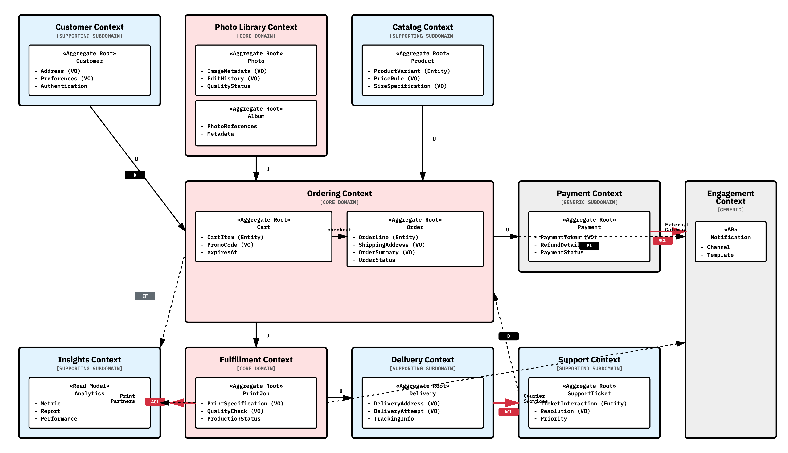
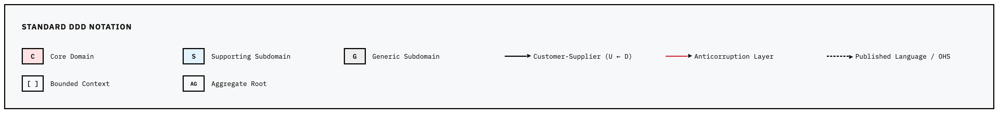
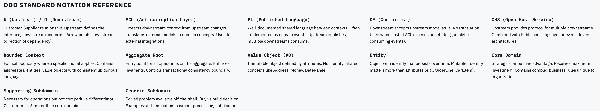

# Online Photo Printing Service - Context Map Diagram

This document provides visual representations of the bounded contexts and their relationships for the online photo printing service.

## Context Map Overview

## Legend

## Notation Guide

---

For detailed information about each bounded context, aggregates, and design decisions, see the [Online Photo Printing Service - DDD Design](online_photo_store.md).

For a text-based visual context map, see the [Visual Context Map](context_map.md).
